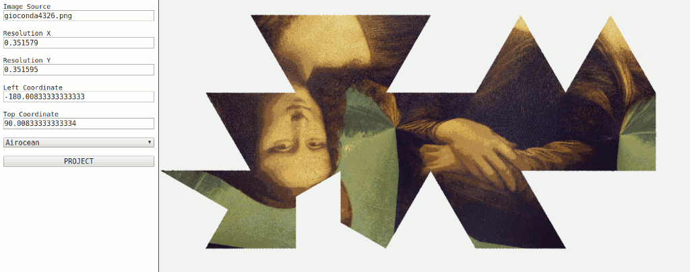

# png-projection

### simple GUI to test d3js projection with png images

inputs

- Image Source: path to image 
- Resolution X: horizontal resolution of pixel
- Resolution Y: vertical resolution of pixel
- Left Coordinate: x coordinate in EPSG:4326 of left limit of the image
- Top Coordinate: y coordinate in EPSG:4326 of top limit of the image

default values work for an image with width 1024px and height 512px that covers the global extension.

this GUI uses projections from following libraries:

- [d3-geo-polygon](https://github.com/d3/d3-geo-polygon)
- [d3-geo-projection](https://github.com/d3/d3-geo-projection)

sample image modified from https://commons.wikimedia.org/wiki/File:Mona_Lisa,_by_Leonardo_da_Vinci,_from_C2RMF_retouched.jpg

### Notes:

- the pourpose of this repository is only for testing
- output images on canvas have some visual error due to projection workflow 1px to 1px
- sometimes the projection takes long time to process